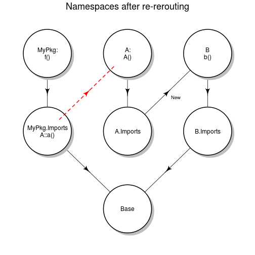

## Motivation

As stated in the the "Writing R Extensions", the Software for Data Analysis book (aka the R bible), packages should
whenever possible use **Imports** instead of **Depends**, to avoid name collision (masking) and ensure trustworthy computations. 
See [this discussion on Stackoverflow](http://stackoverflow.com/questions/8637993/better-explanation-of-when-to-use-imports-depends).

## The problem

So after adopting best practices, and only using **Imports** in my packages, the problem is that some _imported_ packages 
do not follow those best practices and rely on **Depends** for their dependencies, and consequently will not find 
their dependencies unless hacked.  

Say we are writing a package **MyPkg**, that uses some functions from a CRAN package **A**, which lists a CRAN 
package **B** in its Depends.

_MyPkg::f_
```
f <- function() a()
```
_A::a_
```
a <- function() b()
```

Executing `f()` will find the function `a`, explicitly imported from package A. But executing `a()` will die because 
function `b` can not be found.

## analysis

Because B is in A Depends, `b()` is normally found in the search path, where namespace **B** is attached. 
What can we do to work around this problem ?  
Sadly, there is nothing we can do at the  **MyPkg** package level, since the problem sits in the **A** namespace.
We could of course lists B in the **MyPkg** Depends, but that is precisely what we want to avoid.

## the dirty hack solution

### the idea

I suggest that you first have a look at this very good blog 
[How R Searches and Finds Stuff](http://obeautifulcode.com/R/How-R-Searches-And-Finds-Stuff/) if you need some 
clarification about namespaces and imports.  


Here is a diagram of the current state of the problem:

 


We want the `a()` call, which is executed in namespace **A**, to find the **b** symbol in namespace **B**. 
To achieve this, we will re-route the namespace **A** (actually its Imports namespace) to the **B** namespace:
```
nsa <- getNamespace('A')
nsa_imp <- parent.env(nsa)
parent.env(nsa_imp) <- getNamespace('B')
```

Now our namespaces should look like this:  

 


## Example


The above code is not straightforward to test because you need to write a package.  

Here is some reproducible code that illustrates how the hack works, using package **multcomp** that _Depends_ on **mvtnorm**


```r
l <- loadNamespace("multcomp")  # assignment to avoid annoying print

amod <- aov(breaks ~ wool + tension, data = warpbreaks)
wht <- multcomp::glht(amod, linfct = multcomp::mcp(tension = "Tukey"))
ci <- confint(wht)  # mvtnorm::qmvt is not found
```

```
## Error: could not find function "qmvt"
```

```r

# let's load the mvtnorm namespace
l <- loadNamespace("mvtnorm")
ci <- confint(wht)  # mvtnorm::qmvt still not found
```

```
## Error: could not find function "qmvt"
```

```r

# hack hack hack
ns1 <- getNamespace("multcomp")
ns1_imp <- parent.env(ns1)
parent.env(ns1_imp) <- getNamespace("mvtnorm")

ci <- confint(wht)  # now should work
print(ci)
```

```
## 
## 	 Simultaneous Confidence Intervals
## 
## Multiple Comparisons of Means: Tukey Contrasts
## 
## 
## Fit: aov(formula = breaks ~ wool + tension, data = warpbreaks)
## 
## Quantile = 2.416
## 95% family-wise confidence level
##  
## 
## Linear Hypotheses:
##            Estimate lwr     upr    
## M - L == 0 -10.000  -19.357  -0.643
## H - L == 0 -14.722  -24.079  -5.366
## H - M == 0  -4.722  -14.079   4.634
```


## implementation of the hack in MyPkg

Just put the re-routing code in your MyPkg **.onLoad** function, defined usually in `R/zzz.R`:

```
.onLoad <- function(libname, pkgname) {
    nsa <- getNamespace('A')
    nsa_imp <- parent.env(nsa)
    parent.env(nsa_imp) <- getNamespace('B')    
}
```

### why dirty ?

First of all, it uses `parent.env<-`, and according to the documentation:
>The replacement function parent.env<- is extremely dangerous as it can be used to destructively change environments in ways >that violate assumptions made by the internal C code. It may be removed in the near future.

It is a pity because it can be extremely useful.

### why a hack ?

Unfortunately it does not work in the general case. 
Suppose you need two packages A and D, that both depend on B and C, but with different rules:
```
A -> B -> C
D -> C -> B
```
In that case, we would re-route A to B, then B to C. And this is incompatible with the way D is designed, resulting in
wrong symbol picks if symbols with same name are both defined by B and C.

### so what ?

We'll see in a future post a probably much better solution.


_Karl Forner @ Quartz Bio_


