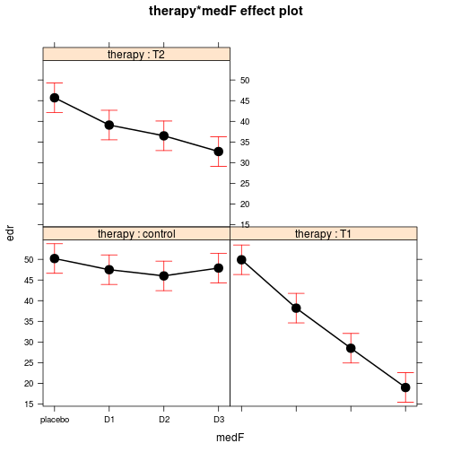

```r
library(multcomp)
library(car)
library(effects)
library(phia)
```


Combine car, multcomp and phia to perform smarter linear modeling.
=====================================
These examples have been largely inpired by Helios De Rosario-Martinez <helios.derosario at ibv.upv.es> [vignette](http://cran.r-project.org/web/packages/phia/vignettes/phia.pdf) from the [phia](http://cran.r-project.org/web/packages/phia/index.html). I recommend as well as the reading of [mutlcomp](http://cran.r-project.org/web/packages/multcomp/) textbook: [Multiple Comparisons Using R](http://www.amazon.co.uk/gp/product/1584885742/) from Multiple Comparisons from Torsten Hothorn, Frank Bretz and Peter Westfall. The [car](http://socserv.socsci.mcmaster.ca/jfox/Books/Companion/index.html ressource is obviously a place to be :-).


.The Boik data set from **phia** is based on the hypothetical example used by R.J. Boik (1979) to explain the analysis of interaction contrasts. It represents the electrodermal response of 72 students complaining of hemophobia, treated with different fear reduction therapies and doses of antianxiety medication, in a balanced factorial design. The response variable **edr** is modeled with two factors **therapy**, with levels control, T1, and 
T2 and **medication**, with levels placebo, D1, D2, and D3 in interaction.

Introduction
-------------------------

```r
some(Boik)
```

```
##    therapy medication   edr
## 7  control         D1 45.59
## 12 control         D1 44.75
## 13 control         D2 47.64
## 16 control         D2 44.86
## 20 control         D3 50.92
## 36      T1         D1 44.24
## 44      T1         D3 11.61
## 50      T2    placebo 40.25
## 53      T2    placebo 45.22
## 56      T2         D1 40.49
```

```r
table(Boik[, 1:2])
```

```
##          medication
## therapy   placebo D1 D2 D3
##   control       6  6  6  6
##   T1            6  6  6  6
##   T2            6  6  6  6
```

I chose to tweak a bit this data set to avoid using the medication as an ordered factor to ease my interpretation 
of linear models outputs.


```r
Boik$medF <- factor(as.character(Boik$medication), levels = c("placebo", "D1", "D2", "D3"))
levels(Boik$medF)
```

```
## [1] "placebo" "D1"      "D2"      "D3"
```


Fit two models with interaction and main effects only
-------------------------

```r
mod.boik <- lm(edr ~ therapy * medF, data = Boik)
mod.boik.M <- lm(edr ~ therapy + medF, data = Boik)
summary(mod.boik)
```

```
## 
## Call:
## lm(formula = edr ~ therapy * medF, data = Boik)
## 
## Residuals:
##     Min      1Q  Median      3Q     Max 
## -11.358  -1.857   0.307   2.717   7.714 
## 
## Coefficients:
##                  Estimate Std. Error t value Pr(>|t|)    
## (Intercept)        50.200      1.787   28.10  < 2e-16 ***
## therapyT1          -0.301      2.527   -0.12    0.906    
## therapyT2          -4.501      2.527   -1.78    0.080 .  
## medFD1             -2.701      2.527   -1.07    0.289    
## medFD2             -4.201      2.527   -1.66    0.102    
## medFD3             -2.301      2.527   -0.91    0.366    
## therapyT1:medFD1   -8.998      3.573   -2.52    0.014 *  
## therapyT2:medFD1   -3.899      3.573   -1.09    0.280    
## therapyT1:medFD2  -17.199      3.573   -4.81  1.0e-05 ***
## therapyT2:medFD2   -4.998      3.573   -1.40    0.167    
## therapyT1:medFD3  -28.599      3.573   -8.00  4.8e-11 ***
## therapyT2:medFD3  -10.699      3.573   -2.99    0.004 ** 
## ---
## Signif. codes:  0 '***' 0.001 '**' 0.01 '*' 0.05 '.' 0.1 ' ' 1 
## 
## Residual standard error: 4.38 on 60 degrees of freedom
## Multiple R-squared: 0.843,	Adjusted R-squared: 0.815 
## F-statistic: 29.4 on 11 and 60 DF,  p-value: <2e-16
```

```r
Anova(mod.boik)
```

```
## Anova Table (Type II tests)
## 
## Response: edr
##              Sum Sq Df F value  Pr(>F)    
## therapy        2444  2    63.8 1.4e-15 ***
## medF           2371  3    41.3 1.3e-14 ***
## therapy:medF   1376  6    12.0 8.5e-09 ***
## Residuals      1149 60                    
## ---
## Signif. codes:  0 '***' 0.001 '**' 0.01 '*' 0.05 '.' 0.1 ' ' 1
```


Use allEffects(), and interactionMeans() to compute cells and marginal means
-------------------------


```r
boik.means <- interactionMeans(mod.boik)
boik.means
```

```
##    therapy    medF adjusted mean
## 1  control placebo          50.2
## 2       T1 placebo          49.9
## 3       T2 placebo          45.7
## 4  control      D1          47.5
## 5       T1      D1          38.2
## 6       T2      D1          39.1
## 7  control      D2          46.0
## 8       T1      D2          28.5
## 9       T2      D2          36.5
## 10 control      D3          47.9
## 11      T1      D3          19.0
## 12      T2      D3          32.7
```

```r
interactionMeans(mod.boik, factors = "therapy")
```

```
##   therapy adjusted mean
## 1 control          47.9
## 2      T1          33.9
## 3      T2          38.5
```

```r

interactionMeans(mod.boik, factors = "medF")
```

```
##      medF adjusted mean
## 1 placebo          48.6
## 2      D1          41.6
## 3      D2          37.0
## 4      D3          33.2
```

Several type of interaction plots  are available to visualise the 'interaction effect'

```r
plot(boik.means, multiple = TRUE)


plot(allEffects(mod.boik))
```

 


The phia package is remarkebly designed to compute  various contrasts of interests using testInteractions() function.
-------------------------

The columns medication1, . . . medication3 in the resulting table contain the value of the three
orthogonal contrasts across the levels of medication, for each level of therapy (the only fixed factor
in this example). In addition a F test (actually a global F test) is performed for each level of therapy


```r
testInteractions(mod.boik, fixed = "therapy", across = "medF", adjustment = "none")
```

```
## F Test: 
## P-value adjustment method: none
##           medF1 medF2 medF3 Df Sum of Sq     F  Pr(>F)    
## control     2.3  -0.4  -1.9  3        54  0.95    0.42    
##      T1    30.9  19.2   9.5  3      3154 54.90 < 2e-16 ***
##      T2    13.0   6.4   3.8  3       539  9.38 3.6e-05 ***
## Residuals                   60      1149                  
## ---
## Signif. codes:  0 '***' 0.001 '**' 0.01 '*' 0.05 '.' 0.1 ' ' 1
```

Behind the scene, **testInteractions()** calls **testFactors()**. The ones corresponding to the one above are detailed below.

```r
con.therapy <- testFactors(mod.boik, levels = list(therapy = c("control")), 
    terms.formula = ~medF, adjustment = "none")
```


```r
testFactors(mod.boik, levels = list(therapy = c("T1")), terms.formula = ~medF, 
    adjustment = "none")
testFactors(mod.boik, levels = list(therapy = c("T2")), terms.formula = ~medF, 
    adjustment = "none")
```

The cont.therapy ob

```r
con.therapy
```

```
## 
## Call: blogify(model = ".") 
## 
## Term (Intercept) 
## 
## Adjusted mean:
##      
## 47.9 
## 
## Linear hypothesis test
## 
## Hypothesis:
## (Intercept)  + 0.25 medFD1  + 0.25 medFD2  + 0.25 medFD3 = 0
## 
## Model 1: restricted model
## Model 2: edr ~ therapy * medF
## 
##   Res.Df   RSS Df Sum of Sq    F Pr(>F)    
## 1     61 56214                             
## 2     60  1149  1     55065 2875 <2e-16 ***
## ---
## Signif. codes:  0 '***' 0.001 '**' 0.01 '*' 0.05 '.' 0.1 ' ' 1 
## ------
## 
## Term medF 
## 
## Adjusted mean at contrasts of medF:
##   medF1   medF2   medF3 
##  2.3006 -0.4008 -1.8999 
## 
## Linear hypothesis test
## 
## Hypothesis:
## - medFD3 = 0
## medFD1 - medFD3 = 0
## medFD2 - medFD3 = 0
## 
## Model 1: restricted model
## Model 2: edr ~ therapy * medF
## 
##   Res.Df  RSS Df Sum of Sq     F Pr(>F)
## 1     63 1203                          
## 2     60 1149  3     54.38 0.947  0.424
## ------
```

```r
names(con.therapy)
```

```
## [1] "call"             "model.call"       "levels"          
## [4] "factor.contrasts" "covariates"       "terms"
```

It contains notably the hypothesis matrix done for a **global F test** that test the non equality of the edr value for the designated therapy level across levels of medication. 

```r
con.therapy$terms$`(Intercept)`$adjusted.values
```

```
##      [,1]
## [1,] 47.9
```

```r
con.therapy$terms$medF$adjusted.values
```

```
##          [,1]
## medF1  2.3006
## medF2 -0.4008
## medF3 -1.8999
```

```r
con.therapy$terms$medF$hypothesis.matrix
```

```
##       (Intercept) therapyT1 therapyT2 medFD1 medFD2 medFD3
## medF1           0         0         0      0      0     -1
## medF2           0         0         0      1      0     -1
## medF3           0         0         0      0      1     -1
##       therapyT1:medFD1 therapyT2:medFD1 therapyT1:medFD2 therapyT2:medFD2
## medF1                0                0                0                0
## medF2                0                0                0                0
## medF3                0                0                0                0
##       therapyT1:medFD3 therapyT2:medFD3
## medF1                0                0
## medF2                0                0
## medF3                0                0
```


The default contrasts definition used in the testInteractions() and testFactors() are takken from their default.contrasts=c("contr.sum","contr.poly"), which is usually not the ones that were used by default in R (see below and the **mod.boik** model).
This is very  **important** as it ensures that F tests and global F tests are meaningfull.

```r
options("contrasts")
```

```
## $contrasts
##         unordered           ordered 
## "contr.treatment"      "contr.poly"
```

```r
contr.sum(levels(Boik$medF))
```

```
##         [,1] [,2] [,3]
## placebo    1    0    0
## D1         0    1    0
## D2         0    0    1
## D3        -1   -1   -1
```

```r
contr.treatment(levels(Boik$medF))
```

```
##         D1 D2 D3
## placebo  0  0  0
## D1       1  0  0
## D2       0  1  0
## D3       0  0  1
```


The therapy adjusted.values are computed using the folowing algebra.

```r
# using the hypothesis matrix
con.therapy$terms$medF$hypothesis.matrix %*% coef(mod.boik)
```

```
##          [,1]
## medF1  2.3006
## medF2 -0.4008
## medF3 -1.8999
```

```r
# which correponds to a contrasts sum options
t(contr.sum(levels(Boik$medF))[-c(1), ]) %*% coef(mod.boik)[c(4:6)]
```

```
##         [,1]
## [1,]  2.3006
## [2,] -0.4008
## [3,] -1.8999
```

```r
# the default contrast (the one used in the model and summary output) are
# reprouced below
t(contr.treatment(levels(Boik$medF))[-c(1), ]) %*% coef(mod.boik)[c(2:4)]
```

```
##       [,1]
## D1 -0.3008
## D2 -4.5012
## D3 -2.7014
```


How to obtain the same results with different functions
======================================================================================================================================
Especially, how to reproduce classic univariates results.


Obtain Anova global F interaction test with **linearHypothesis()**.
-------------------------

```r
coefs <- coefficients(mod.boik)
coefs
```

```
##      (Intercept)        therapyT1        therapyT2           medFD1 
##          50.2004          -0.3008          -4.5012          -2.7014 
##           medFD2           medFD3 therapyT1:medFD1 therapyT2:medFD1 
##          -4.2005          -2.3006          -8.9975          -3.8985 
## therapyT1:medFD2 therapyT2:medFD2 therapyT1:medFD3 therapyT2:medFD3 
##         -17.1985          -4.9984         -28.5994         -10.6990
```

```r
linearHypothesis(mod.boik, names(coefs)[7:12], verbose = TRUE)
```

```
## 
## Hypothesis matrix:
##                  (Intercept) therapyT1 therapyT2 medFD1 medFD2 medFD3
## therapyT1:medFD1           0         0         0      0      0      0
## therapyT2:medFD1           0         0         0      0      0      0
## therapyT1:medFD2           0         0         0      0      0      0
## therapyT2:medFD2           0         0         0      0      0      0
## therapyT1:medFD3           0         0         0      0      0      0
## therapyT2:medFD3           0         0         0      0      0      0
##                  therapyT1:medFD1 therapyT2:medFD1 therapyT1:medFD2
## therapyT1:medFD1                1                0                0
## therapyT2:medFD1                0                1                0
## therapyT1:medFD2                0                0                1
## therapyT2:medFD2                0                0                0
## therapyT1:medFD3                0                0                0
## therapyT2:medFD3                0                0                0
##                  therapyT2:medFD2 therapyT1:medFD3 therapyT2:medFD3
## therapyT1:medFD1                0                0                0
## therapyT2:medFD1                0                0                0
## therapyT1:medFD2                0                0                0
## therapyT2:medFD2                1                0                0
## therapyT1:medFD3                0                1                0
## therapyT2:medFD3                0                0                1
## 
## Right-hand-side vector:
## [1] 0 0 0 0 0 0
## 
## Estimated linear function (hypothesis.matrix %*% coef - rhs)
## therapyT1:medFD1 therapyT2:medFD1 therapyT1:medFD2 therapyT2:medFD2 
##           -8.998           -3.899          -17.199           -4.998 
## therapyT1:medFD3 therapyT2:medFD3 
##          -28.599          -10.699
```

```
## Linear hypothesis test
## 
## Hypothesis:
## therapyT1:medFD1 = 0
## therapyT2:medFD1 = 0
## therapyT1:medFD2 = 0
## therapyT2:medFD2 = 0
## therapyT1:medFD3 = 0
## therapyT2:medFD3 = 0
## 
## Model 1: restricted model
## Model 2: edr ~ therapy * medF
## 
##   Res.Df  RSS Df Sum of Sq  F  Pr(>F)    
## 1     66 2525                            
## 2     60 1149  6      1376 12 8.5e-09 ***
## ---
## Signif. codes:  0 '***' 0.001 '**' 0.01 '*' 0.05 '.' 0.1 ' ' 1
```


Obtain univariate linear model coefficients statistics done with **summary()** with **testFactors()**
-------------------------

```r
summary(mod.boik)
```

```
## 
## Call:
## lm(formula = edr ~ therapy * medF, data = Boik)
## 
## Residuals:
##     Min      1Q  Median      3Q     Max 
## -11.358  -1.857   0.307   2.717   7.714 
## 
## Coefficients:
##                  Estimate Std. Error t value Pr(>|t|)    
## (Intercept)        50.200      1.787   28.10  < 2e-16 ***
## therapyT1          -0.301      2.527   -0.12    0.906    
## therapyT2          -4.501      2.527   -1.78    0.080 .  
## medFD1             -2.701      2.527   -1.07    0.289    
## medFD2             -4.201      2.527   -1.66    0.102    
## medFD3             -2.301      2.527   -0.91    0.366    
## therapyT1:medFD1   -8.998      3.573   -2.52    0.014 *  
## therapyT2:medFD1   -3.899      3.573   -1.09    0.280    
## therapyT1:medFD2  -17.199      3.573   -4.81  1.0e-05 ***
## therapyT2:medFD2   -4.998      3.573   -1.40    0.167    
## therapyT1:medFD3  -28.599      3.573   -8.00  4.8e-11 ***
## therapyT2:medFD3  -10.699      3.573   -2.99    0.004 ** 
## ---
## Signif. codes:  0 '***' 0.001 '**' 0.01 '*' 0.05 '.' 0.1 ' ' 1 
## 
## Residual standard error: 4.38 on 60 degrees of freedom
## Multiple R-squared: 0.843,	Adjusted R-squared: 0.815 
## F-statistic: 29.4 on 11 and 60 DF,  p-value: <2e-16
```

```r
testFactors(mod.boik, levels = list(therapy = c("T1", "control"), medF = "placebo"), 
    adjustment = "none")$terms[["(Intercept)"]]$test
```

```
## Linear hypothesis test
## 
## Hypothesis:
## therapyT1 = 0
## 
## Model 1: restricted model
## Model 2: edr ~ therapy * medF
## 
##   Res.Df  RSS Df Sum of Sq    F Pr(>F)
## 1     61 1149                         
## 2     60 1149  1     0.272 0.01   0.91
```

```r
testFactors(mod.boik, levels = list(therapy = c("T2", "control"), medF = "placebo"), 
    adjustment = "none")$terms[["(Intercept)"]]$test
```

```
## Linear hypothesis test
## 
## Hypothesis:
## therapyT2 = 0
## 
## Model 1: restricted model
## Model 2: edr ~ therapy * medF
## 
##   Res.Df  RSS Df Sum of Sq    F Pr(>F)  
## 1     61 1210                           
## 2     60 1149  1      60.8 3.17   0.08 .
## ---
## Signif. codes:  0 '***' 0.001 '**' 0.01 '*' 0.05 '.' 0.1 ' ' 1
```

```r
testFactors(mod.boik, levels = list(medF = c("D1", "placebo"), therapy = "control"), 
    adjustment = "none")$terms[["(Intercept)"]]$test
```

```
## Linear hypothesis test
## 
## Hypothesis:
## medFD1 = 0
## 
## Model 1: restricted model
## Model 2: edr ~ therapy * medF
## 
##   Res.Df  RSS Df Sum of Sq    F Pr(>F)
## 1     61 1171                         
## 2     60 1149  1      21.9 1.14   0.29
```

```r
testFactors(mod.boik, levels = list(medF = c("D2", "placebo"), therapy = "control"), 
    adjustment = "none")$terms[["(Intercept)"]]$test
```

```
## Linear hypothesis test
## 
## Hypothesis:
## medFD2 = 0
## 
## Model 1: restricted model
## Model 2: edr ~ therapy * medF
## 
##   Res.Df  RSS Df Sum of Sq    F Pr(>F)
## 1     61 1202                         
## 2     60 1149  1      52.9 2.76    0.1
```

```r
# D3 versus placebo in control group.
testFactors(mod.boik, levels = list(medF = c("D3", "placebo"), therapy = "control"), 
    adjustment = "none")$terms[["(Intercept)"]]$adjusted.values
```

```
##        [,1]
## [1,] -2.301
```

```r
testFactors(mod.boik, levels = list(medF = c("D3", "placebo"), therapy = "control"), 
    adjustment = "none")$terms[["(Intercept)"]]$test
```

```
## Linear hypothesis test
## 
## Hypothesis:
## medFD3 = 0
## 
## Model 1: restricted model
## Model 2: edr ~ therapy * medF
## 
##   Res.Df  RSS Df Sum of Sq    F Pr(>F)
## 1     61 1165                         
## 2     60 1149  1      15.9 0.83   0.37
```

```r
# match the meanInteractions data.frame
boik.means[10, 3] - boik.means[1, 3]
```

```
## [1] -2.301
```


**testInteractions()** can compute pairwise contrasts very fluidly **BUT**
-------------------------
First remember that the testInteraction must used orthonomal contrasts (default.contrasts=c("contr.sum","contr.poly")).
Below, despites the fact that all pairwise combinations were performed, the adjusted means don't correspond 
straightforwardly  to the 'classic' all pairwise group differences

```r
testInteractions(mod.boik, pairwise = "therapy", across = "medF", adjustment = "none")
```

```
## F Test: 
## P-value adjustment method: none
##            medF1 medF2 medF3 Df Sum of Sq     F  Pr(>F)    
## control-T1 -28.6 -19.6 -11.4  3      1332 23.19 4.3e-10 ***
## control-T2 -10.7  -6.8  -5.7  3       176  3.06   0.035 *  
##      T1-T2  17.9  12.8   5.7  3       557  9.69 2.6e-05 ***
## Residuals                    60      1149                  
## ---
## Signif. codes:  0 '***' 0.001 '**' 0.01 '*' 0.05 '.' 0.1 ' ' 1
```

It you're in hurry, you could tweak the call, by changing the default contrasts, **BUT THEN THE F GLOBAL TEST ARE NOT MEANINGFUL ANYMORE**
So don't do that except if you know what you are doing.

```r
# !!! THE F TEST IN EACH ROW ARE NOT MEANINGFUL
# -----------------------------------------------------------------------------------------------
testInteractions(mod.boik, pairwise = "therapy", across = "medF", adjustment = "none", 
    default.contrasts = c("contr.treatment", "contr.poly"))
```

```
## Warning: Contrasts are not orthogonal for factor(s): therapy
```

```
## Warning: Contrasts are not orthogonal for factor(s): therapy
```

```
## Warning: Contrasts are not orthogonal for factor(s): therapy
```

```
## F Test: 
## P-value adjustment method: none
##            medF1 medF2 medF3 Df Sum of Sq    F Pr(>F)    
## control-T1   9.3  17.5  28.9  3      3684 64.1 <2e-16 ***
## control-T2   8.4   9.5  15.2  3      1176 20.5  3e-09 ***
##      T1-T2  -0.9  -8.0 -13.7  3       757 13.2  1e-06 ***
## Residuals                    60      1149                
## ---
## Signif. codes:  0 '***' 0.001 '**' 0.01 '*' 0.05 '.' 0.1 ' ' 1
```

```r

testFactors(mod.boik, levels = list(therapy = c("T1", "T2"), medF = "D1"), adjustment = "none")$terms[["(Intercept)"]]$adjusted.values
```

```
##         [,1]
## [1,] -0.8987
```

```r
testFactors(mod.boik, levels = list(therapy = c("T1", "T2"), medF = "D2"), adjustment = "none")$terms[["(Intercept)"]]$adjusted.values
```

```
##      [,1]
## [1,]   -8
```

testInteractions() and the **custom** argument.
-------------------------
First, as ususal testInteractions() makes calls to testFactors. Without any arguments specified, it does the folowing default comparisons.

```r
testInteractions(mod.boik, adjustment = "none")
```

```
## F Test: 
## P-value adjustment method: none
##                         Value Df Sum of Sq     F  Pr(>F)    
## control-T1 : placebo-D1  -9.0  1       121  6.34 0.01448 *  
## control-T2 : placebo-D1  -3.9  1        23  1.19 0.27960    
##      T1-T2 : placebo-D1   5.1  1        39  2.04 0.15874    
## control-T1 : placebo-D2 -17.2  1       444 23.17 1.0e-05 ***
## control-T2 : placebo-D2  -5.0  1        37  1.96 0.16699    
##      T1-T2 : placebo-D2  12.2  1       223 11.66 0.00115 ** 
## control-T1 : placebo-D3 -28.6  1      1227 64.07 4.8e-11 ***
## control-T2 : placebo-D3 -10.7  1       172  8.97 0.00399 ** 
##      T1-T2 : placebo-D3  17.9  1       481 25.10 5.1e-06 ***
## control-T1 :      D1-D2  -8.2  1       101  5.27 0.02523 *  
## control-T2 :      D1-D2  -1.1  1         2  0.09 0.75929    
##      T1-T2 :      D1-D2   7.1  1        76  3.95 0.05145 .  
## control-T1 :      D1-D3 -19.6  1       576 30.10 8.7e-07 ***
## control-T2 :      D1-D3  -6.8  1        69  3.62 0.06181 .  
##      T1-T2 :      D1-D3  12.8  1       246 12.84 0.00068 ***
## control-T1 :      D2-D3 -11.4  1       195 10.18 0.00226 ** 
## control-T2 :      D2-D3  -5.7  1        49  2.55 0.11587    
##      T1-T2 :      D2-D3   5.7  1        49  2.55 0.11590    
## Residuals                     60      1149                  
## ---
## Signif. codes:  0 '***' 0.001 '**' 0.01 '*' 0.05 '.' 0.1 ' ' 1
```

```r
testFactors(mod.boik, levels = list(therapy = c("T1", "T2"), medF = c("D1", 
    "D2")), adjustment = "none")$terms[["(Intercept)"]]
```

```
## $numeric.variables
## [1] "(Intercept)"
## 
## $factor.variables
## character(0)
## 
## $hypothesis.matrix
##      (Intercept) therapyT1 therapyT2 medFD1 medFD2 medFD3 therapyT1:medFD1
## [1,]           0         0         0      0      0      0                1
##      therapyT2:medFD1 therapyT1:medFD2 therapyT2:medFD2 therapyT1:medFD3
## [1,]               -1               -1                1                0
##      therapyT2:medFD3
## [1,]                0
## 
## $adjusted.values
##       [,1]
## [1,] 7.101
## 
## $test
## Linear hypothesis test
## 
## Hypothesis:
## therapyT1:medFD1 - therapyT2:medFD1 - therapyT1:medFD2  + therapyT2:medFD2 = 0
## 
## Model 1: restricted model
## Model 2: edr ~ therapy * medF
## 
##   Res.Df  RSS Df Sum of Sq    F Pr(>F)  
## 1     61 1225                           
## 2     60 1149  1      75.6 3.95  0.051 .
## ---
## Signif. codes:  0 '***' 0.001 '**' 0.01 '*' 0.05 '.' 0.1 ' ' 1
```

```r
# But We can compare the calculations and see how testInteraction calls
# testFactors()
testInteractions(mod.boik, adjustment = "none")[12, ]
```

```
## F Test: 
## P-value adjustment method: none
##                         Value Df Sum of Sq    F Pr(>F)  
##      T1-T2 :      D1-D2   7.1  1      75.6 3.95  0.051 .
## ---
## Signif. codes:  0 '***' 0.001 '**' 0.01 '*' 0.05 '.' 0.1 ' ' 1
```

```r
testFactors(mod.boik, levels = list(therapy = c("T1", "T2"), medF = c("D1", 
    "D2")), adjustment = "none")$terms[["(Intercept)"]]$adjusted.values
```

```
##       [,1]
## [1,] 7.101
```

```r
testFactors(mod.boik, levels = list(therapy = c("T1", "T2"), medF = c("D1", 
    "D2")), adjustment = "none")$terms[["(Intercept)"]]$test["Pr(>F)"]
```

```
##   Pr(>F)  
## 1         
## 2  0.051 .
## ---
## Signif. codes:  0 '***' 0.001 '**' 0.01 '*' 0.05 '.' 0.1 ' ' 1
```

We can build custom contrast matrices. The code is directly inspired from testFactors() one.

```r
faclist <- lapply(Boik[, 1:2], levels)
faclist
```

```
## $therapy
## [1] "control" "T1"      "T2"     
## 
## $medication
## [1] "placebo" "D1"      "D2"      "D3"
```

```r
facmat.sum <- lapply(faclist, contr.sum)  # default contr.sum matrices used by testFactors()
facmat.sum
```

```
## $therapy
##         [,1] [,2]
## control    1    0
## T1         0    1
## T2        -1   -1
## 
## $medication
##         [,1] [,2] [,3]
## placebo    1    0    0
## D1         0    1    0
## D2         0    0    1
## D3        -1   -1   -1
```

```r
T1.T2.vs.Placebo.D3 <- list(therapy = facmat.sum$therapy[, 2, drop = F], medF = facmat.sum$medication[, 
    1, drop = F])
T1.T2.vs.Placebo.D3
```

```
## $therapy
##         [,1]
## control    0
## T1         1
## T2        -1
## 
## $medF
##         [,1]
## placebo    1
## D1         0
## D2         0
## D3        -1
```

```r
testInteractions(mod.boik, custom = T1.T2.vs.Placebo.D3, adjustment = "none")
```

```
## F Test: 
## P-value adjustment method: none
##                  Value Df Sum of Sq    F  Pr(>F)    
## therapy1 : medF1  17.9  1       481 25.1 5.1e-06 ***
## Residuals              60      1149                 
## ---
## Signif. codes:  0 '***' 0.001 '**' 0.01 '*' 0.05 '.' 0.1 ' ' 1
```

```r
testInteractions(mod.boik, custom = T1.T2.vs.Placebo.D3, adjustment = "none")$Value
```

```
## [1] 17.9   NA
```

```r
testInteractions(mod.boik, custom = T1.T2.vs.Placebo.D3, adjustment = "none")[["Pr(>F)"]]
```

```
## [1] 5.102e-06        NA
```

Hypothesis matrix  (from testFactors() calls) can be reinjected  in the glht framework.
-------------------------

```r
K1 <- summary(testFactors(mod.boik, levels = list(therapy = c("T1", "T2"), medF = "D2"), 
    adjustment = "none"))
K2 <- summary(testFactors(mod.boik, levels = list(therapy = c("T1", "control"), 
    medF = "placebo"), adjustment = "none"))  # This is a default contrast (compute in summary.lm and confint.lm)
K <- rbind(K1$hypothesis.matrix, lfinfct = K2$hypothesis.matrix)
row.names(K) <- c("T1.vs.T2.in.D2", "T1.vs.control.in.placebo")
set.seed(1)
# The contrast matrix extracted from the testFactors result can be used in
# place
set.seed(1)
glht.2 <- glht(mod.boik, linfct = as.matrix(K))
# use glht to compute user defined contrasts with the benefit of joint
# confidence interval estimates and multiple testing correction.
summary(glht.2)
```

```
## 
## 	 Simultaneous Tests for General Linear Hypotheses
## 
## Fit: lm(formula = edr ~ therapy * medF, data = Boik)
## 
## Linear Hypotheses:
##                               Estimate Std. Error t value Pr(>|t|)   
## T1.vs.T2.in.D2 == 0             -8.000      2.527   -3.17   0.0048 **
## T1.vs.control.in.placebo == 0   -0.301      2.527   -0.12   0.9910   
## ---
## Signif. codes:  0 '***' 0.001 '**' 0.01 '*' 0.05 '.' 0.1 ' ' 1 
## (Adjusted p values reported -- single-step method)
```

```r
confint(glht.2)
```

```
## 
## 	 Simultaneous Confidence Intervals
## 
## Fit: lm(formula = edr ~ therapy * medF, data = Boik)
## 
## Quantile = 2.292
## 95% family-wise confidence level
##  
## 
## Linear Hypotheses:
##                               Estimate lwr     upr    
## T1.vs.T2.in.D2 == 0            -8.000  -13.791  -2.208
## T1.vs.control.in.placebo == 0  -0.301   -6.092   5.491
```

These result are *obviously* different from the ones obtained with univariate methods with no correction for multiple testing.

```r
mod.boik
```

```
## 
## Call:
## lm(formula = edr ~ therapy * medF, data = Boik)
## 
## Coefficients:
##      (Intercept)         therapyT1         therapyT2            medFD1  
##           50.200            -0.301            -4.501            -2.701  
##           medFD2            medFD3  therapyT1:medFD1  therapyT2:medFD1  
##           -4.201            -2.301            -8.998            -3.899  
## therapyT1:medFD2  therapyT2:medFD2  therapyT1:medFD3  therapyT2:medFD3  
##          -17.199            -4.998           -28.599           -10.699
```

```r
confint(mod.boik)[2, ]  # This is 'T1.vs.control.in.placebo' default contrast (computed in summary.lm and confint.lm)
```

```
##  2.5 % 97.5 % 
## -5.355  4.753
```


Obtain non corrected for multiple testing  p-values and univariate confidence intervals with glht
-------------------------------------------
There is unfortunately, no **confint** method associated with testFactor results. But you can reproduce univariate confidence intervals with **confint( mod,calpha = univariate_calpha())**method on glht objects obtained with **test = adjusted(type = "none")**

```r
glht.2.s <- summary(glht.2, test = adjusted(type = "none"))
glht.2.s
```

```
## 
## 	 Simultaneous Tests for General Linear Hypotheses
## 
## Fit: lm(formula = edr ~ therapy * medF, data = Boik)
## 
## Linear Hypotheses:
##                               Estimate Std. Error t value Pr(>|t|)   
## T1.vs.T2.in.D2 == 0             -8.000      2.527   -3.17   0.0024 **
## T1.vs.control.in.placebo == 0   -0.301      2.527   -0.12   0.9056   
## ---
## Signif. codes:  0 '***' 0.001 '**' 0.01 '*' 0.05 '.' 0.1 ' ' 1 
## (Adjusted p values reported -- none method)
```

```r
glht.2.s$test$coefficients
```

```
##           T1.vs.T2.in.D2 T1.vs.control.in.placebo 
##                  -7.9998                  -0.3008
```

```r
ghlt2.confint.u <- confint(glht.2.s, calpha = univariate_calpha())
ghlt2.confint.u$confint
```

```
##                          Estimate     lwr    upr
## T1.vs.T2.in.D2            -7.9998 -13.054 -2.946
## T1.vs.control.in.placebo  -0.3008  -5.355  4.753
## attr(,"conf.level")
## [1] 0.95
## attr(,"calpha")
## [1] 2
```

```r

confint(mod.boik)[2, ] == ghlt2.confint.u$confint[2, 2:3]
```

```
##  2.5 % 97.5 % 
##   TRUE   TRUE
```

This *trick* is used  because **confint** method  is not dispatched with testFactor results.

```r
fact.boik <- testFactors(mod.boik, levels = list(therapy = c("T1", "T2"), medF = "D2"), 
    adjustment = "none")
confint(fact.boik)
```

```
## Error: no applicable method for 'vcov' applied to an object of class
## "c('testFactors.lm', 'testFactors')"
```


